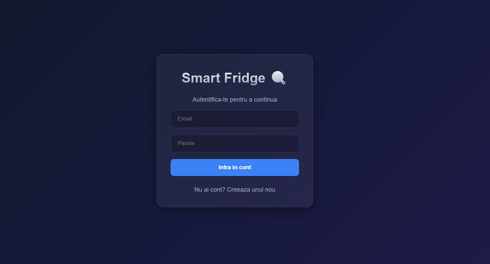
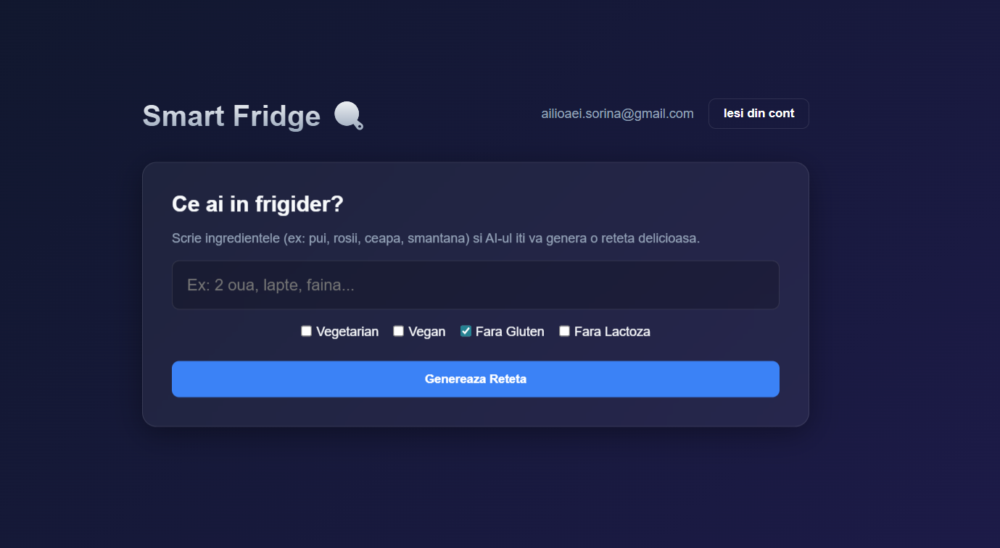
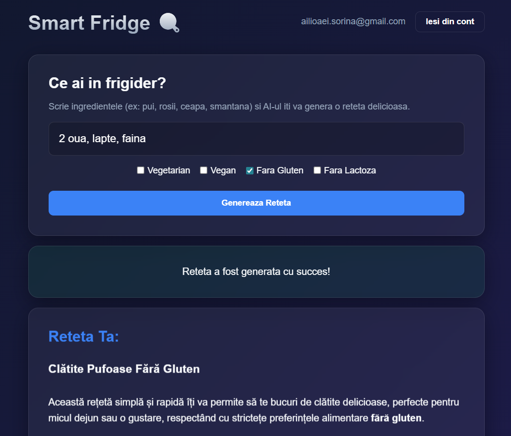
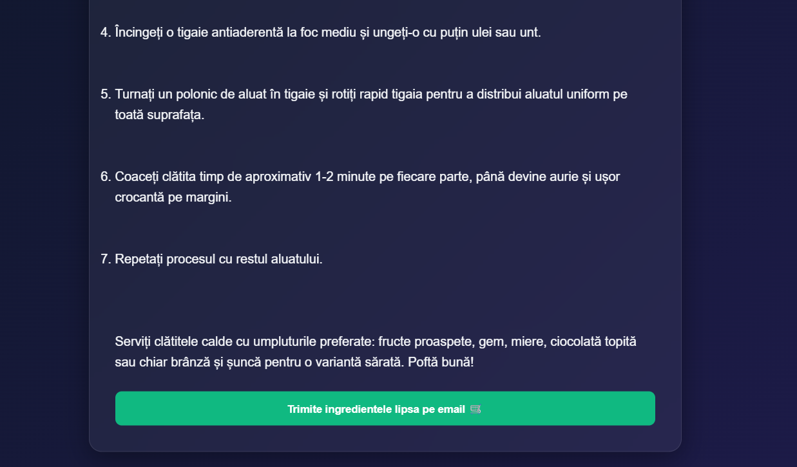
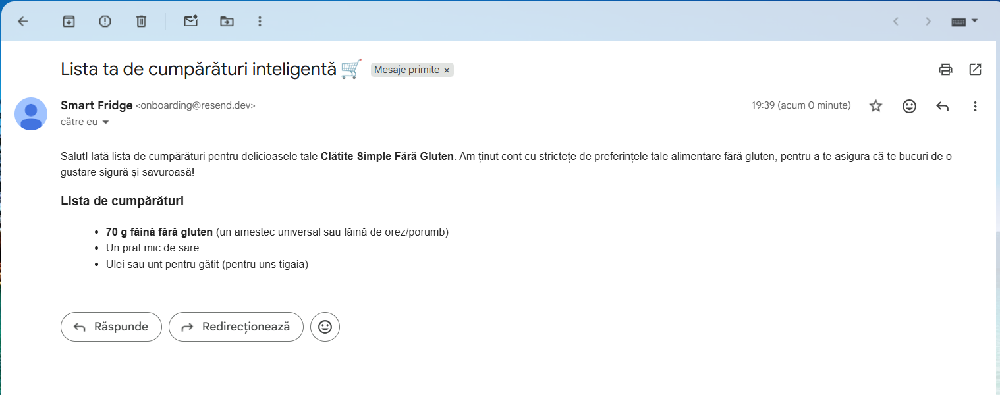

# Documentație: Smart Fridge 🍳
Link video: https://youtu.be/FElNqB4EKXk

Link publicare: https://smart-fridge-app-f0d4.onrender.com/

> **Notă pentru evaluator:** Deoarece aplicația este găzduită pe o infrastructură cloud gratuită (Render.com), serverul intră automat în sleep după 15 minute de inactivitate. La prima accesare a linkului, vă rog să așteptați aproximativ 30-50 de secunde pentru repornirea serverului Java. După această primă încărcare, aplicația va răspunde instantaneu.

## 1. Introducere

**Smart Fridge** este o aplicație web, full-stack, concepută pentru a reduce risipa alimentară și a inspira creativitatea în bucătărie. Aplicația permite utilizatorilor să introducă ingredientele pe care le au deja în frigider și, cu ajutorul Inteligenței Artificiale (Google Gemini API), să genereze rețete personalizate. În plus, aplicația ține cont de preferințele alimentare (ex. vegetarian, fără gluten) și poate genera o listă de cumpărături cu ingredientele lipsă, trimițând-o direct pe adresa de email a utilizatorului.

Din punct de vedere tehnic, aplicația utilizează o arhitectură cu un backend dezvoltat în **Java Spring Boot**, iar pe partea de frontend o interfață construită cu HTML, CSS și Vanilla JavaScript. Autentificarea este gestionată eficient prin intermediul serviciului **Supabase**.

---

## 2. Descriere problemă

Problema principală pe care aplicația o rezolvă este risipa alimentară, combinată cu lipsa de inspirație a persoanelor în ceea ce privește gătitul. Adesea, oamenii deschid frigiderul, găsesc o combinație de ingrediente aparent incompatibile și decid fie să arunce o parte din ele, fie să comande mâncare. 

Prin introducerea ingredientelor disponibile în aplicație, utilizatorul primește instantaneu o soluție practică: o rețetă completă pe care o poate găti. Alternativ, dacă îi lipsesc anumite ingrediente pentru o masă completă, AI-ul deduce automat rețeta ideală și extrage doar ingredientele necesare, facilitând procesul de cumpărături printr-un email automatizat.

---

## 3. Descriere API

Aplicația backend expune un REST API care face legătura între interfața web și serviciile externe de AI (Gemini) și Email (Resend). API-ul este format din două controllere principale:

### A. `RecipeController`
* **Scop:** Se ocupă cu interogările către inteligența artificială și procesul de trimitere a emailurilor.
* **Endpoint:** `/api/generate-recipe`

### B. `PreferenceController`
* **Scop:** Se ocupă cu setările și preferințele alimentare ale utilizatorilor (stocate în memoria serverului) pe baza adresei de email.
* **Endpoint-uri:** `/api/preferences`

### Servicii Cloud Utilizate

Aplicația se bazează pe următoarele trei servicii cloud pentru a oferi funcționalitatea completă:

1. **Google Gemini API**: este un serviciu de Inteligență Artificială generativă. În cadrul proiectului, acesta primește textul cu ingredientele utilizatorului și preferințele alimentare, generând în mod inteligent rețetele culinare sau listele cu ingredientele lipsă.
2. **Resend API**: este o platformă cloud destinată trimiterii de emailuri tranzacționale, folosită pentru a trimite instantaneu lista detaliată de cumpărături generată de AI.
3. **Supabase**: este o platformă Backend-as-a-Service (BaaS). În acest proiect, Supabase este utilizat pentru gestionarea autentificării, oferind un sistem securizat prin care utilizatorii își pot crea conturi și se pot loga în aplicație.

---

## 4. Flux de date

Fluxul de funcționare a aplicației urmează pașii următori:
1. **Autentificare:** Utilizatorul se autentifică folosind Supabase. Token-ul și identitatea sunt păstrate pe partea de client.
2. **Colectarea Preferințelor:** Frontend-ul interoghează backend-ul pentru preferințele anterioare. Orice modificare a checkbox-urilor trimite un request de tip `PUT` către server.
3. **Procesarea AI:** Când utilizatorul apasă „Generează Rețetă”, un request `POST` este trimis la server, conținând ingredientele, adresa de email și tipul acțiunii (`recipe` sau `shopping_list`).
4. **Apelul Extern:** Backend-ul citește preferințele utilizatorului, construiește un prompt inteligent și îl trimite către Google Gemini.
5. **Livrarea Răspunsului:** Pentru rețete, textul HTML generat de AI este trimis înapoi către frontend. Pentru liste de cumpărături, backend-ul contactează API-ul Resend, trimite emailul către adresa utilizatorului și confirmă acțiunea în frontend.

### Metode HTTP și Exemple de Request / Response

#### 1. POST `/api/generate-recipe`
**Descriere:** Generează rețeta sau trimite lista de cumpărături pe mail.
* **Request Body (JSON):**
```json
{
  "ingredients": "2 oua, lapte, faina",
  "email": "[EMAIL_ADDRESS]",
  "action": "recipe" // sau "shopping_list"
}
```
> **Nota arhitecturala:** Cand se face request pentru `shopping_list`, frontend-ul concatenează automat la finalul parametrului `ingredients` întregul text HTML al rețetei anterior generate. Astfel, AI-ul primește contextul complet direct din interfață, eliminând necesitatea ca serverul backend să stocheze starea rețetelor în memoria RAM.
* **Response Body (JSON - Success):**
```json
{
  "recipe": "<h3>Clatite rapide</h3><ul><li>2 oua...</li></ul><p>Amesteca...</p>",
  "message": null,
  "error": null
}
```

#### 2. GET `/api/preferences?email=user@example.com`
**Descriere:** Afișează preferințele alimentare ale utilizatorului salvate pe server.
* **Response Body (JSON):**
```json
[
  "Vegetarian",
  "Fara Gluten"
]
```

#### 3. PUT `/api/preferences`
**Descriere:** Actualizează (sau creează) lista de preferințe pentru utilizatorul specificat.
* **Request Body (JSON):**
```json
{
  "email": "user@example.com",
  "preferences": ["Vegetarian", "Fără Lactoză"]
}
```
* **Response Code:** `200 OK` (fără body)

### Autentificare și autorizare servicii utilizate

1. **Supabase (BaaS):** autentificarea utilizatorilor se face *client-side* prin librăria Supabase JS (via CDN). Aplicația utilizează o cheie `anon_key` pentru a accesa API-ul public Supabase și pentru a gestiona sesiunea (login/register).
2. **Google Gemini API:** backend-ul Spring Boot folosește un `API_KEY` privat (stocat în `application.properties`) trimis în Header-ul HTTP la fiecare cerere către `generativelanguage.googleapis.com` pentru a autoriza generarea textelor.
3. **Resend API:** trimiterea listelor de cumpărături se face apelând API-ul Resend, unde autorizarea se face folosind un token de tip "Bearer" citit din variabilele de mediu ale aplicației Spring Boot.

---
## 5. Capturi ecran aplicație






---

## 6. Referințe

* **Java Spring Boot:** [https://spring.io/projects/spring-boot](https://spring.io/projects/spring-boot)
* **Google Gemini API:** [https://ai.google.dev/docs](https://ai.google.dev/docs)
* **Resend Email API:** [https://resend.com/docs/api-reference](https://resend.com/docs/api-reference)
* **Supabase Authentication:** [https://supabase.com/docs/guides/auth](https://supabase.com/docs/guides/auth)
